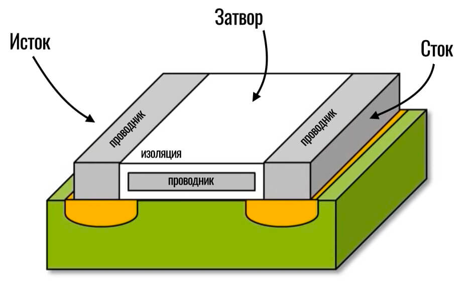

# Транзистор
## **Что такое транзистор в процессоре и в памяти**
**Транзистор** — это основа любого процессора, памяти и других микросхем. Он представляет собой крошечное устройство, способное работать в двух режимах: усиления или переключения электрического сигнала. Нас интересует именно режим переключателя.

Переключатель работает аналогично, как переключатель с лампочкой:

Транзистор играет роль выключателя и лампочки.

**Основа любой вычислительной техники — это единички и нолики.** Просмотр видео на смартфоне, прослушивание музыки, дополненная реальность и нейронные сети — все это работает на «единичках и ноликах»:

|**Единица** — есть ток|**Ноль** — нет тока|
| :-: | :-: |

Именно для получения единиц и нулей мы используем транзисторы. Когда из этого миниатюрного устройства выходит ток, мы говорим, что это единица, когда нет никакого электрического сигнала — получаем ноль.

Соответственно, один транзистор — это совершенно бесполезная ерунда, которая не сможет сделать ничего. Даже, чтобы посчитать 2+2 нам нужны десятки транзисторов.

Итак, для создания транзистора мы берем немножко песка (условно какую-то часть одной песчинки) и делаем из него микроскопическую основу:

Это будет наша кремниевая подложка (кремний получают именно из песка). Теперь нужно на эту основу нанести две области.

Итак, на подложке создаются две проводящие области:: в одну ток подаем (вход в транзистор), а из другой — считываем (выход):

Мы сделали эти области внутри кремниевой подложки таким образом, чтобы ток не смог пройти от входа к выходу. Он будет останавливаться самим кремнием (показан зеленым цветом). Чтобы ток смог пройти от входа к выходу по поверхности кремниевой подложки, нужно сверху разместить проводящий материал (скажем, металл) и хорошенько его изолировать:

**А теперь самое важное**! Когда мы подадим напряжение на этот изолированный кусочек металла, размещенный над кремниевой подложкой, он создаст вокруг себя электрическое поле. Изоляция никак не будет влиять на действие этого электрического поля. И здесь происходит вся «магия»: слой кремния под действием этого электрического поля начинает проводить ток от входа к выходу! То есть, когда мы подаем напряжение, ток может легко протекать между двумя областями:

Вот и все! Осталось дело за малым — подключить «провода» (электроды) к входу, выходу и кусочку изолированного металла, с помощью которого мы и будем включать/выключать транзистор. Назовем их так:

Вход — Исток

Выход — Сток

Металл с изоляцией — Затвор

Для закрепления материала немного поиграемся с этим транзистором.

Итак, транзистор находится под напряжением, то есть электричество подается на исток. Но на затворе тока нет, так как на наш транзистор не «пришла единица». Соответственно затвор «закрыл» транзистор и ток по нему пройти дальше не сможет, так что и на выходе из транзистора мы получаем ноль:

Теперь ситуация изменилась и на затворе транзистора появилось напряжение, которое создало электрическое поле, позволившее току пройти через транзистор от истока к стоку. Как результат — транзистор выдал единицу (есть электрический сигнал):

Вот так все просто! То есть, основное напряжение поступает на вход ко всем транзисторам, но будет ли каждый конкретный транзистор пропускать этот ток дальше — зависит от незначительного напряжения на затворе. Это напряжение может появляться, например, когда другой транзистор, подключенный к этому, отправил электрический импульс («единичку»).

График зависимости силы тока, от напряжения, в выключенном низкий показатель и высокий в включенном состоянии

## **Внешний вид современных транзисторов:**

Так как состоянием транзистора управляет электрический ток, переключение происходит очень быстро. На базе этого элемента построено все, что хранит информацию, регистры в процессоре, оперативная память, память в твердотельных накопителях, кэш и так далее.

**Сравнение размеров транзисторов с человеческим волосом**

