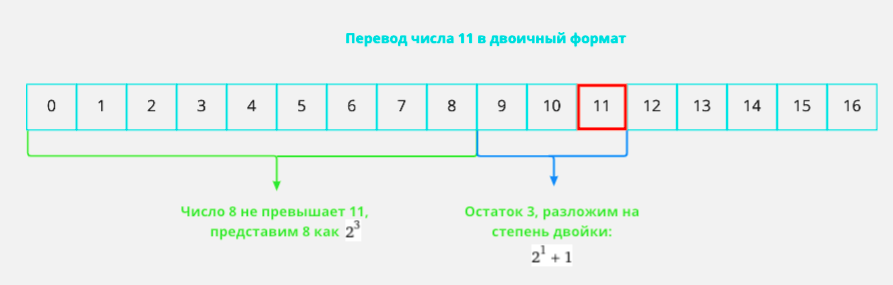
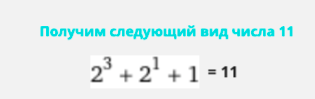
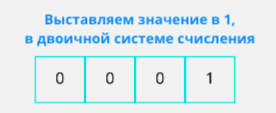
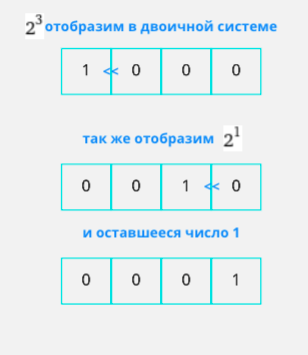
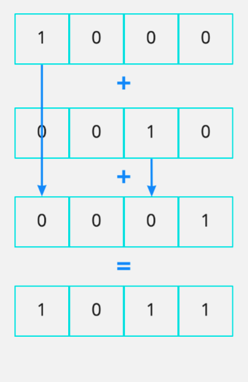
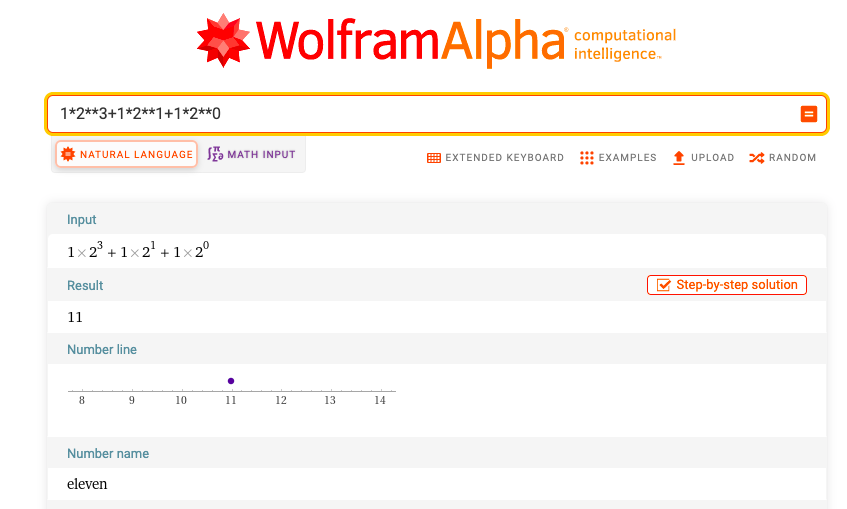
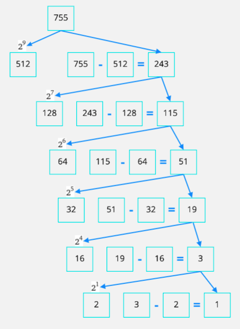
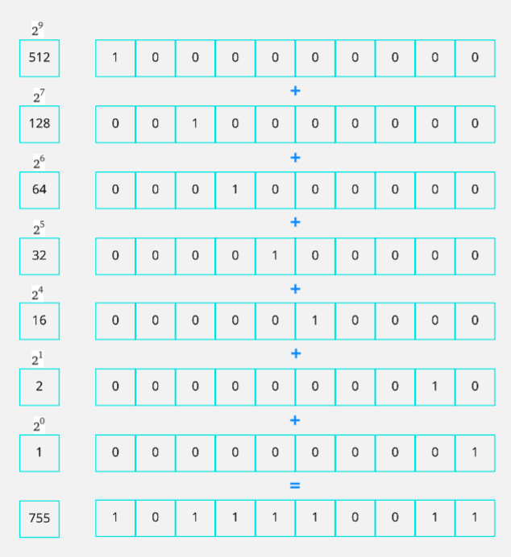
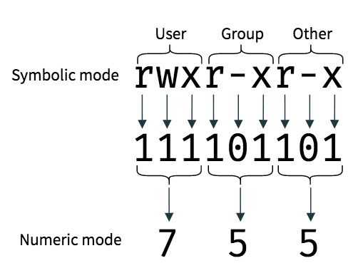

# Двоичная система счисления

**Видео** “[Двоичная система счисления — самое простое объяснение](https://youtu.be/RcxvcLl1nAs "https://youtu.be/RcxvcLl1nAs")” [целиком]

<b>Двоичная система счисления</b> — позиционная система счисления с основанием 2 (например <b>1012</b>.) Благодаря непосредственной реализации в цифровых электронных схемах на логических вентилях, двоичная система используется практически во всех современных компьютерах и прочих вычислительных электронных устройствах.

В двоичной системе счисления числа записываются с помощью двух символов (0 и 1). Чтобы не путать, в какой системе счисления записано число, его снабжают указателем справа внизу. Например, число в десятичной системе <b>510</b>, в двоичной <b>1012</b>. Иногда двоичное число обозначают префиксом 0b или символом & (амперсанд), например 0b101 или соответственно &101.

В двоичной системе счисления (как и в других системах счисления, кроме десятичной) знаки читаются по одному. Например, число <b>1012</b> произносится «один ноль один».

В основном придется работать с 64 битами, так как архитектура современных процессоров 64 бита, по технологии amd64, является шириной шины процессора, далее в курсе будет подробно описано об этом.

## **Размерность в информационных системах**
**1 bit - это двоичное значение, принимает 1 или 0**

**Бит** (русское обозначение: **бит**; международное: **bit**; от [англ.] ***bi**nary digi**t*** — [двоичная цифра](https://ru.wikipedia.org/wiki/%D0%94%D0%B2%D0%BE%D0%B8%D1%87%D0%BD%D0%BE%D0%B5_%D1%87%D0%B8%D1%81%D0%BB%D0%BE "https://ru.wikipedia.org/wiki/%D0%94%D0%B2%D0%BE%D0%B8%D1%87%D0%BD%D0%BE%D0%B5_%D1%87%D0%B8%D1%81%D0%BB%D0%BE"); также [игра слов](https://ru.wikipedia.org/wiki/%D0%98%D0%B3%D1%80%D0%B0_%D1%81%D0%BB%D0%BE%D0%B2 "https://ru.wikipedia.org/wiki/%D0%98%D0%B3%D1%80%D0%B0_%D1%81%D0%BB%D0%BE%D0%B2"): [англ.] *bit* — кусочек, частица) — [единица измерения](https://ru.wikipedia.org/wiki/%D0%95%D0%B4%D0%B8%D0%BD%D0%B8%D1%86%D1%8B_%D0%B8%D0%B7%D0%BC%D0%B5%D1%80%D0%B5%D0%BD%D0%B8%D1%8F_%D0%B8%D0%BD%D1%84%D0%BE%D1%80%D0%BC%D0%B0%D1%86%D0%B8%D0%B8 "https://ru.wikipedia.org/wiki/%D0%95%D0%B4%D0%B8%D0%BD%D0%B8%D1%86%D1%8B_%D0%B8%D0%B7%D0%BC%D0%B5%D1%80%D0%B5%D0%BD%D0%B8%D1%8F_%D0%B8%D0%BD%D1%84%D0%BE%D1%80%D0%BC%D0%B0%D1%86%D0%B8%D0%B8") [количества информации](https://ru.wikipedia.org/wiki/%D0%9A%D0%BE%D0%BB%D0%B8%D1%87%D0%B5%D1%81%D1%82%D0%B2%D0%BE_%D0%B8%D0%BD%D1%84%D0%BE%D1%80%D0%BC%D0%B0%D1%86%D0%B8%D0%B8 "https://ru.wikipedia.org/wiki/%D0%9A%D0%BE%D0%BB%D0%B8%D1%87%D0%B5%D1%81%D1%82%D0%B2%D0%BE_%D0%B8%D0%BD%D1%84%D0%BE%D1%80%D0%BC%D0%B0%D1%86%D0%B8%D0%B8"). 1 бит информации — символ или сигнал, который может принимать два значения: включено или выключено, да или нет, высокий или низкий, заряженный или незаряженный; в двоичной системе исчисления это 1 (единица) или 0 (ноль). Это минимальное количество информации, которое необходимо для ликвидации минимальной неопределенности.

1 byte = 8 bit

1 Kb = 1000 byte

1 Mb = 1000 Kb

1 Gb = 1000 Mb

1 Tb = 1000 Gb

## **Пример перевода числа в двоичную систему**
**Способ разложения:**

Рассмотрим пример разложения числа 11 в двоичную систему, для этого нам надо разложить число на ближайшую степень двойки:

Самым ближайшим числом степени 2, будет число 8, так как следующее уже 16, превышает число 11:

Для отображения степени двойки в двоичной системе, воспользуемся битовым сдвигом. Для начала надо выставить число 1, в самое начало:

Далее будем сдвигать влево, согласно указанной степени, например 2³, сдвинем 3 раза и т.д.:

Далее просуммируем что у нас получилось:

Ответ **1011**, проверим на сайте <https://www.wolframalpha.com/input?i=1*2**3%2B1*2**1%2B1*2**0>

Пример разложения числа 755:

Распишем каждое число в двоичной, сложим:

**Задачи**

**Задача 1.**  *Как представлено число 7310 в двоичной системе счисления?*

`  	`a)  1001011        b) 111101         c) 101011        d) 1001001

Решение.   Для быстрого и точного решения задачи достаточно разложить исходное число на сумму степеней двойки, а затем записать «1» на место существующей степени и «0» - на место пропущенной степени двойки.

Тогда     *7310 = 26 + 23 + 20  =  10010012*

(шестая степень есть – 1, пятой нет – 0, четвертой нет – 0, третья есть – 1, второй нет – 0, первой нет – 0, нулевая есть – 1).

Возможные ловушки:

- если исходное число четное, то нужно не забыть о нулевой степени числа.
- вариант ответа b). Нужно помнить правильность перевода числа из десятичной системы счисления в двоичную, что десятичная система не «дружит» ни с какой другой в окружении систем с основанием, меньшим 100 (а на другие задачи мы не решаем), и пользоваться таблицей «дружбы» для перевода в двоичную систему счисления нельзя.

Проверка решения:  По закономерности 4 из теоретической части:  **NL-1 ≤  Ch <  NL**

`               	        	 `Тогда  	64  ≤  73  <  128 , то есть  26 ≤  73  <  27

`                                `Длина результата равна 7, как и в полученном ответе.

Эта проверка действует на оба варианта из возможных совершенных ошибок.

На ЕГЭ более вариантов ответов не предусматривается.

Ответ: d (1001001)

**Задача 2**.  *Сколько единиц в двоичной записи числа 187 ?*

Решение.   Для быстрого и точного решения задачи достаточно разложить исходное число на сумму степеней двойки, а затем посчитать количество присутствующих степеней.

Тогда   *187 = 128 + 32 + 16 + 8 + 2 + 1* , то есть будет всего шесть степеней двойки.

Заметим, что более никаких действий для получения ответа здесь выполнять не нужно!

Для проверки правильности решения достаточно сложить полученные числа и сравнить их с исходным числом.

**Задача 3.**  *Сколько нулей в двоичной записи числа 204 ?*

Решение.   Для быстрого и точного решения задачи достаточно разложить исходное число на сумму степеней двойки, а затем посчитать количество присутствующих степеней.

Тогда   *205 = 128 + 64 + 8 + 4*  , то есть будет всего 4 степени  двойки. А длина числа при переводе в двоичную систему счисления будет  равна 8 (27  ≤  205  <  28). Тогда количество нулей в числе будет равно разнице между ними:           *8 - 4 = 4*.

Заметим, что более никаких действий для получения ответа здесь выполнять не нужно!

**Задача 4.** Доступы в операционной системе linux обозначаются числами, например 755, является флагами в двоичной системе:

В блоке доступа по 3 бита, первый бит отвечает за доступ чтения (r - read), второй бит за доступ записи(w - write), 3 бит за доступ исполнения файла в системе(x - execute). Первый блок отвечает за доступ пользователя, второй за доступ группы и последний блок с 7-9 бит общий доступ для всех.

Рассчитать, какие доступы дают данные числа:
777,

644,

700,

327,

744

Расписать доступы по группам **User**, **Group**, **Other**, как на картинке сверху, в виде:

**Group**: rwx **User**: r-x: **Other**: --x

**Задача 5.** Рассчитать максимальную скорость обмена в шине из оперативной памяти. Ширина шины 64 бита или 64 канала, то есть одновременно можно передать 64 бита данных. Рассчитать максимальную скорость передачи данных в шине, размерность Gb/s для оперативной памяти, тактовой частотой процессора пренебрегаем, для ОЗУ (оперативное запоминающее устройство) со следующими параметрами:

DDR2 400 MHz

DDR2 533 MHz

DDR2 667 MHz

DDR2 800 MHz

DRR3 1066 MHz

DDR3 1333 MHz

DDR3 1600 MHz

DDR4 2133 MHz

DDR4 3200 MHz

DDR4 5333 MHz

**Задача 6.** Рассчитать время загрузки файла, размером 6765 Tb, для канала передачи со следующими параметрами:

100 Mbit/s

2 Mbit/s

1 Gbit/s

600 Mbit/s

Возможные ошибки: Проверка на внимательность студента, часто биты путают с байтами, так как в одном байте 8 бит, если задача будет рассчитана для байт в секунду, ответы будут неверными.

**Задача 7.** Рассчитать сколько места утилизируют в оперативной памяти следующие объекты:

144 чисел float64

144 чисел float32

6765 чисел int64

6765 чисел int32

[англ.]: https://ru.wikipedia.org/wiki/%D0%90%D0%BD%D0%B3%D0%BB%D0%B8%D0%B9%D1%81%D0%BA%D0%B8%D0%B9_%D1%8F%D0%B7%D1%8B%D0%BA "https://ru.wikipedia.org/wiki/%D0%90%D0%BD%D0%B3%D0%BB%D0%B8%D0%B9%D1%81%D0%BA%D0%B8%D0%B9_%D1%8F%D0%B7%D1%8B%D0%BA"
